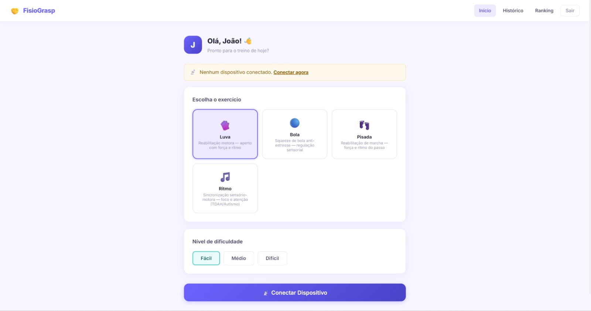
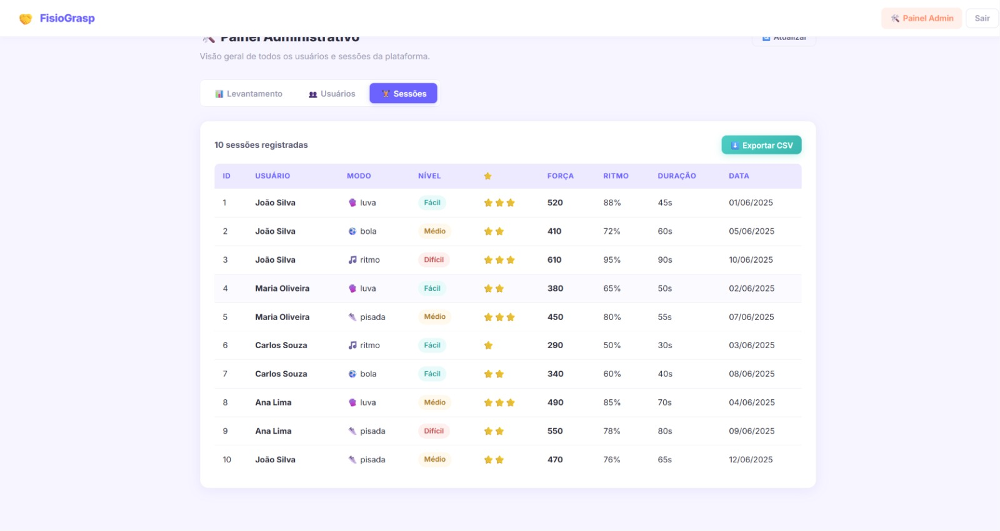
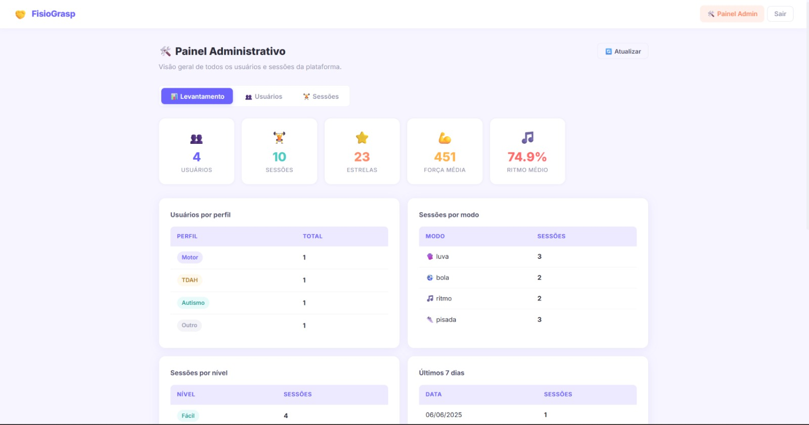

# 🖐️ FisioGrasp — Plataforma de Reabilitação Gamificada


FisioGrasp é uma plataforma de **reabilitação física gamificada**, que integra uma luva com sensores (Arduino), um back-end em **C++**, um front-end em **React/Vite** e banco de dados **MySQL**, permitindo acompanhar sessões de exercícios, gerar rankings e visualizar relatórios administrativos.

## Sumário

- [Screenshots](#screenshots)
- [Estrutura do projeto](#estrutura-do-projeto)
- [Banco de dados (MySQL)](#1-banco-de-dados-mysql)
- [Back-end (C++)](#2-back-end-c)
- [Front-end (React)](#3-front-end-react)
- [Painel administrativo](#4-painel-administrativo)
- [Fluxo do sistema](#fluxo-do-sistema)
- [Rotas da API](#rotas-da-api)
- [Licença](#licença)

## Screenshots

| Início — escolha do exercício | Painel Admin — Sessões |
|:---:|:---:|
|  |  |

| Painel Admin — Levantamento |
|:---:|
|  |

## Estrutura do projeto

```
fisiogrip/
├── db/               # Banco de dados MySQL
├── backend/          # Servidor C++
└── frontend/         # App React
```

---

## 1. Banco de dados (MySQL)

Execute os arquivos na ordem abaixo:

```sql
SOURCE db/tabelas.sql;
SOURCE db/views.sql;
SOURCE db/functions.sql;
SOURCE db/crud.sql;
SOURCE db/poo.sql;
SOURCE db/triggers.sql;
SOURCE db/logica.sql;
SOURCE db/dados.sql;
```

---

## 2. Back-end (C++)

### Dependências necessárias
- [cpp-httplib](https://github.com/yhirose/cpp-httplib) — servidor HTTP (baixe `httplib.h` e coloque em `backend/`)
- `libmysqlcppconn-dev` — conexão MySQL
- `nlohmann-json3-dev` — parsing JSON
- `libssl-dev` — usado pelo jwt-cpp para assinar tokens (HS256)
- jwt-cpp já vem vendorizado em `backend/jwt-cpp/include/` (não precisa instalar)

### Compilar e rodar
```bash
cd backend
make
./fisiogrip_server
# Servidor rodando em http://localhost:8080
```
(alternativa: `cmake -B build && cmake --build build && ./build/fisiogrip_server`)

---

## 3. Front-end (React)

```bash
cd frontend
npm install
npm run dev
# App rodando em http://localhost:3000
```

---

## 4. Painel administrativo

Alguns emails são cadastrados como administradores em `backend/security/admin_config.h`:

```cpp
static const std::unordered_set<std::string> admins = {
    "admin@fisiogrip.com",
    "gustavo@fisiogrip.com"
    // adicione novos emails de administrador aqui
};
```

Qualquer usuário que se cadastre (`/register`) usando um desses emails recebe, ao fazer login, um token JWT com a claim `is_admin: true` e é redirecionado automaticamente para `/admin`. Usuários comuns não veem o link "Admin" no menu nem conseguem acessar as rotas administrativas (retornam `403`).

Rotas administrativas (todas exigem `Authorization: Bearer <token>` de um admin):

| Método | Rota               | Descrição                                    |
|--------|--------------------|-----------------------------------------------|
| GET    | /admin/usuarios    | Lista todos os usuários cadastrados            |
| GET    | /admin/sessoes     | Lista todas as sessões de todos os usuários    |
| GET    | /admin/relatorio   | Levantamento agregado (totais, médias, top 5)  |

O painel (`/admin` no frontend) mostra cartões de totais, tabelas por perfil/modo/nível, top 5 do ranking, sessões dos últimos 7 dias, e permite exportar todas as sessões em CSV.

⚠️ Depois de mudar `admin_config.h`, é necessário recompilar o backend (`make`).

## Fluxo do sistema

```
Arduino (HC-05)
    │  Bluetooth (pacote: "SESSAO|modo:luva|forca_media:420|...")
    ▼
Front-end React
    │  HTTP + JWT
    ▼
Back-end C++
    │  CALL sp_model("sessao", "create", {...})
    ▼
MySQL
    └─ triggers atualizam ranking automaticamente
```

## Rotas da API

| Método | Rota                        | Descrição                      |
|--------|-----------------------------|--------------------------------|
| POST   | /login                      | Autenticação                   |
| POST   | /register                   | Cadastro de usuário            |
| POST   | /logout                     | Encerrar sessão                |
| GET    | /dispositivo/listar/:id     | Lista dispositivos do usuário  |
| POST   | /dispositivo/conectar       | Ativa dispositivo BT           |
| POST   | /sessao/iniciar             | Inicia sessão de exercício     |
| POST   | /sessao/encerrar            | Encerra e salva dados          |
| GET    | /sessao/historico/:id       | Histórico do usuário           |
| GET    | /ranking/geral              | Ranking geral                  |
| GET    | /ranking/usuario/:id        | Ranking do usuário             |
| GET    | /admin/usuarios             | (admin) Lista todos os usuários|
| GET    | /admin/sessoes              | (admin) Lista todas as sessões |
| GET    | /admin/relatorio            | (admin) Levantamento agregado  |

## Licença

Este projeto está licenciado sob a licença MIT — veja o arquivo [LICENSE](LICENSE) para mais detalhes.
